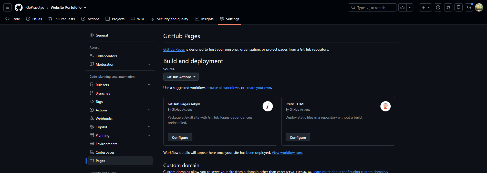
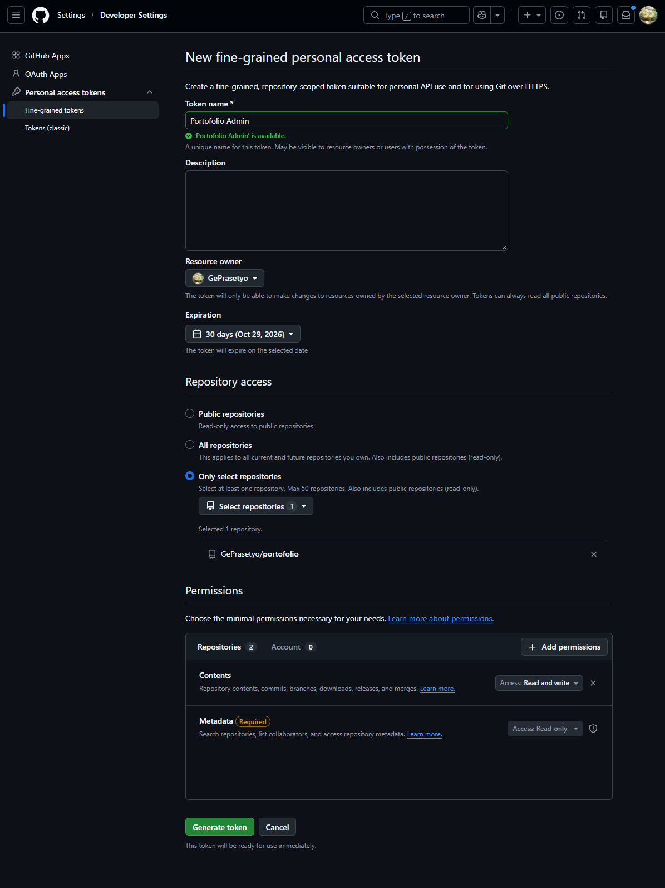
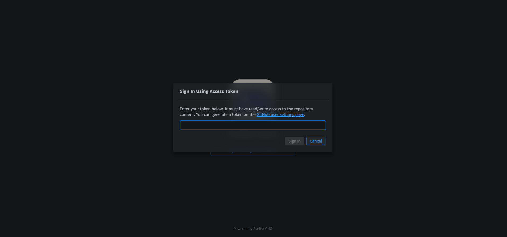
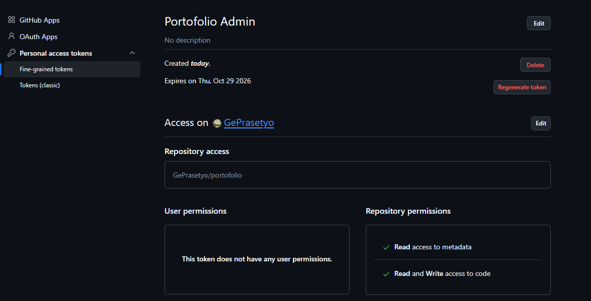

# Website-Portofolio

A free portfolio website that you run yourself. It's hosted on GitHub, and you update the words, pictures and videos from a simple editor in your browser. No coding needed.

Setup takes about 15 minutes, and you only do it once. All you need is a free [GitHub account](https://github.com/signup).

**Steps:** [1. Get your own copy](#1-get-your-own-copy) · [2. Put your website online](#2-put-your-website-online) · [3. Make a key for the editor](#3-make-a-key-for-the-editor) · [4. Open the editor](#4-open-the-editor) · [5. Make it yours](#5-make-it-yours) · [6. When your key runs out](#6-when-your-key-runs-out) · [Something not working?](#something-not-working)

---

## 1. Get your own copy

Everything for your site lives in a *repository*, which is simply a project folder on GitHub. First, make your own copy of this one.

1. Sign in to GitHub, then click the green **Use this template** button at the top of this page and choose **Create a new repository**.
2. Give it a name. The name becomes part of your website address:
   - Name it **`yourusername.github.io`** (with your own GitHub username) and your site will be at `https://yourusername.github.io/`
   - Any other name, for example **`portfolio`**, gives you `https://yourusername.github.io/portfolio/`
3. Leave it set to **Public**, then click **Create repository**.

## 2. Put your website online

1. In your new repository, click **Settings** (top menu), then **Pages** (left menu).
2. Under **Build and deployment**, change **Source** to **GitHub Actions**. It saves by itself.

   

   GitHub will suggest some options below it, such as "GitHub Pages Jekyll". **Ignore them**; don't click Configure. Your copy already has everything it needs.

3. Click the **Actions** tab (top menu). On the left, click **Deploy site**, then click **Run workflow**, and **Run workflow** again in the box that opens.
4. Wait about a minute until it shows a green ✓. Your website is now online at the address from step 1.

You might also see an earlier red ✗ in that list. That's normal: it ran before you switched Pages on.

## 3. Make a key for the editor

The editor needs permission to save changes to your website. You give it that permission with a *token*: a long password that works only for this one website and can only change its content.

1. Open **[this link to create a token](https://github.com/settings/personal-access-tokens/new)**. (Or: your profile picture → **Settings** → **Developer settings** at the bottom of the left menu → **Personal access tokens** → **Fine-grained tokens** → **Generate new token**.)
2. Fill in the form:
   - **Token name:** anything you'll recognise, e.g. `Portfolio editor`
   - **Expiration:** how long the key works, e.g. 30 or 90 days. You can renew it later ([step 6](#6-when-your-key-runs-out)).
   - **Repository access:** choose **Only select repositories**, open **Select repositories** and pick the repository you made in step 1.
   - **Permissions:** click **Add permissions**, tick **Contents**, then set its **Access** to **Read and write**.

     **Metadata** gets added by itself as "Required". That's expected, so leave it. Don't add anything else.

   

3. Click **Generate token** at the bottom.
4. GitHub shows your token **once**. Click the copy button next to it and keep it somewhere safe, such as your password manager.

Keep this token private, like a password. Don't post it or share screenshots of it.

## 4. Open the editor

1. Go to your website address with **`/admin/`** added to the end, for example `https://yourusername.github.io/portfolio/admin/`. Bookmark this page.
2. Click **Sign In with Token**, paste your token, and click **Sign In**.

   

Anyone can open the `/admin/` page, but without your token they can't see or change anything. Visitors to your website never need to sign in.

Your browser remembers you. On a shared computer, sign out when you're finished: click the account icon in the top-right corner, then **Sign Out**.

## 5. Make it yours

Your copy starts with example text and placeholder pictures. Replace them with your own.

On the left of the editor you'll see:

- **Projects:** each project gets its own page and a card on the home page.
- **Home page:** your main page, split into parts in the same order as on the page:
  - **Welcome screen (optional):** a full-screen first view with your name and one button (see below)
  - **Profile:** your name, job title, email and résumé (PDF)
  - **Intro (top of page):** your title lines, a short "about me" and your links
  - **Work section (heading), Experience, Skills, About, Contact:** the rest of the page
- **Look & feel:** how your whole site looks (see below).

Every field has a short explanation in grey underneath it. Fields marked with a star (*) must be filled in.

**To change something:** open it, edit the fields, then click **Save**. Saving keeps your changes but doesn't update your website yet, so you can make lots of changes without waiting.

**To update your website:** click **Publish Changes** at the top of the editor. Your website updates about a minute later; refresh the page to see it. To save and publish in one go, click the arrow next to **Save** and choose **Save and Publish**. Deleting a project or picture publishes straight away, so it's gone from your site.

**Preview:** the right half of the editor shows the page you're editing in your site's theme, and changes as you type. It includes everything you've saved, even before you publish. It's a close preview: small details such as curly quotes can differ on the real site.

**Look & feel:**
- **Theme:** how the whole site is laid out. **Showcase** puts your pictures and videos first, and **Editorial** looks like a magazine. Your words, pictures and videos stay the same when you switch.
- **Colours:** each theme has its own, or pick another set, or choose **My own colours**.
- **Fonts:** each theme has its own, or pick another pair, or choose **My own Google Fonts**: on [fonts.google.com](https://fonts.google.com), add one or two fonts to your selection, click **Get embed code** and paste the code into the editor. The first font is for headings, the second for the rest of the text.
- **Light and dark:** follow the visitor's phone or computer (with a switch on the page), or always light, or always dark.
- Click **See what each theme looks like** under Theme for pictures of every theme, colour set and font.

**Projects:**
- To **add a project**, open **Projects** and click **New**.
- The **Order** number decides where a project appears: 1 comes first.
- Switch on **Highlight** to make a project stand out on the home page, for example with a bigger card.
- A project page is built from **Page sections**, which you can add, remove and reorder. Each section has an optional heading and 1, 2 or 3 **columns**, and holds **items**:
  - text, with bold, italic, links and bullet points
  - a picture, a video or a 3D model
  - a card, for example an award
  - a list, for example quick facts
  - buttons (links)
- An item fills one column. Set its **Width** to Wide (two columns) or Whole row to make it bigger.
- To hide an example project, switch off **Show on site** and save. Or delete it.

**About:** the About part of your home page is a set of boxes, such as Recognition and Quick facts. Rename them, remove them or add more.

**Welcome screen:** switch on **Show a welcome screen** under Home page for a full-screen first view with your name and one button, for example "Enter". Behind it you can have a colour, a picture, a YouTube video (plays without sound, on repeat) or a 3D model from Sketchfab or ArtStation that visitors can turn. It shows once per visit, and not to people coming back from a project page. Phones get the picture instead of the video or 3D model, unless you switch that on.

**Pictures:**
- JPG, PNG, WebP or AVIF, up to **5 MB** each.
- If a picture is too big, shrink it for free at [squoosh.app](https://squoosh.app).
- Wide pictures (landscape) work best for project cards.

**Videos:**
- Videos come from **YouTube**. Upload yours there first, then paste its link into the video field.
- "Unlisted" YouTube videos work too.
- Video files can't be uploaded to your site. If one gets in, the website won't update until it's removed.

**3D models:**
- 3D models come from **Sketchfab** or **ArtStation**. Upload yours there first.
- **Sketchfab:** open the model and copy the link from your browser's address bar, e.g. `https://sketchfab.com/3d-models/my-model-1a2b3c…`
- **ArtStation:** open your artwork, copy the **embed code** under the 3D viewer and paste all of it. The artwork's page link on its own doesn't work.
- Sketchfab tends to be more reliable. ArtStation's viewer is sometimes blocked by its bot protection, and those visitors see an empty box.

**Text styling:**
- Text items in project sections have a toolbar for bold, italic, links and bullet points.
- In other text fields, put two stars on each side to make text **bold**: `**like this**`
- One star on each side makes it *italic*: `*like this*`
- For a link: `[the words people click](https://the-address.com)`

## 6. When your key runs out

When your token expires, the editor stops letting you in. Your website stays online the whole time. You don't have to make a new token; you can renew the old one:

1. Open your [tokens page](https://github.com/settings/personal-access-tokens) and click your token's name.
2. Click **Regenerate token**, choose a new expiration, and confirm.

   

3. Copy the new token. The old one stops working.
4. In the editor, sign out, then sign in again with the new token.

If your token was ever seen by someone else, click **Delete** on the same page. It stops working right away. Then make a new one as in [step 3](#3-make-a-key-for-the-editor).

---

## Something not working?

**My website shows "404" or "Site not found"**
- Open the **Actions** tab and check that the newest **Deploy site** has a green ✓.
- Also check that **Settings → Pages → Source** says **GitHub Actions**.
- After the first green ✓, it can take another minute or two to appear.

**Deploy site has a red ✗**
- Click it to see which step failed.
- **Setup Pages:** Pages isn't switched on yet. Do [step 2](#2-put-your-website-online), then run it again.
- **Check uploads:** a file that isn't allowed got in, such as a video, another file type, or a file over 5 MB. The details list which file. In the editor, open **Assets**, delete that file, and the site updates again.

**The editor won't let me sign in**
- Check that the token includes the right repository and has **Contents: Read and write**.
- Check that the token hasn't expired ([step 6](#6-when-your-key-runs-out)).

**I saved, but my website hasn't changed**
- Saving doesn't update your website on its own. Click **Publish Changes** at the top of the editor.
- Then wait for the green ✓ in the **Actions** tab.
- Then reload your site with **Ctrl + Shift + R**, or **Cmd + Shift + R** on a Mac.

---

## For developers

- **How it's built:** the site is built with Jekyll by GitHub Actions (`.github/workflows/pages.yml`). Content lives in `_data/` and `_work/`, and templates in `index.html`, `_layouts/` and `_includes/`. The editor is [Sveltia CMS](https://github.com/sveltia/sveltia-cms), configured in `admin/config.yml`. Editor saves are committed with `[skip ci]` (`skip_ci` in `admin/config.yml`) and deploy when someone clicks Publish Changes, which sends the `sveltia-cms-publish` event the workflow listens for; other pushes to `main` deploy as usual.
- **Themes:** content never says how it looks. `_layouts/default.html` reads Look & feel (`_data/look.yml`) and hands the page to the chosen theme: `_includes/themes/<theme>/` (`frame.html`, `home.html`, `work.html`), styled by `assets/css/<theme>.css`. Project items share one markup, `_includes/item.html`, which also documents the content model. Colours and fonts reach every theme as CSS custom properties (`_includes/look.html`), from the presets in `_data/palettes.yml` and `_data/fonts.yml`.
- **Adding a theme:** add its folder under `_includes/themes/` and its stylesheet, register it in `_data/themes.yml`, add it to the Theme options in `admin/config.yml`, and add screenshots to `admin/looks/`.
- **Editor preview:** `admin/preview.js` renders the page being edited in the browser with [LiquidJS](https://liquidjs.com), from the same templates Jekyll uses. `_tools/preview_bundle.py` packs `_includes/` and `_layouts/` into `admin/preview/templates.json` before each build (`.github/workflows/pages.yml`), and Jekyll writes the saved data to `admin/preview/site.json`. Keep templates to Liquid that both Jekyll and LiquidJS understand, and don't name fields `size`, `first` or `last` (Liquid reads those as list properties).
- **Custom domain:** on `github.io`, the site address and repository are detected automatically. On a custom domain, set `url` and `baseurl` in `_config.yml`, and `backend.repo`, `site_url` and `display_url` in `admin/config.yml`.
- **Local preview:**

  ```sh
  pip install python-liquid markdown pyyaml
  python _tools/render.py
  python -m http.server -d _site 8765
  ```

## Credits

- Editor: [Sveltia CMS](https://github.com/sveltia/sveltia-cms) (MIT licence)
- Editor preview: [LiquidJS](https://github.com/harttle/liquidjs) and [marked](https://github.com/markedjs/marked) (MIT licence)
- Placeholder videos: open movies by the [Blender Foundation](https://studio.blender.org/films/)
- Fonts: Archivo, IBM Plex Sans, Anton, Space Grotesk, Inter, Fraunces and JetBrains Mono from Google Fonts (SIL Open Font Licence)

## Licence

Free to use and change under the [MIT licence](LICENSE).
